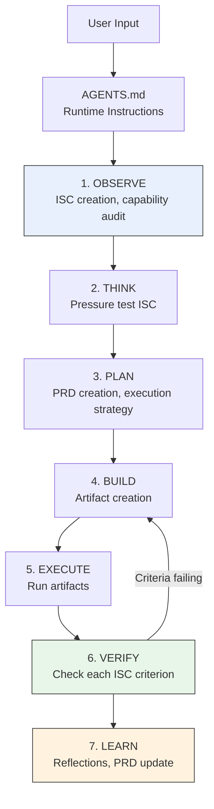

# PAI-OpenCode System Architecture

> [!NOTE]
> **Authoritative source for Algorithm self-awareness (ADR-017 / WP-N6)**

---

## Directory Layout

```text
pai-opencode/
├── .opencode/
│   ├── plugins/                  ← Plugin system (loaded by opencode at startup)
│   │   ├── pai-unified.ts        ← Single plugin entry point — all hooks registered here
│   │   ├── handlers/             ← Modular handler implementations
│   │   │   ├── session-registry.ts      (WP-N1) Custom tools: session_registry, session_results
│   │   │   ├── compaction-intelligence.ts (WP-N2) Context injection during compaction
│   │   │   ├── roborev-trigger.ts       (WP-N7) Custom tool: code_review via roborev
│   │   │   ├── agent-capture.ts         Agent output capture
│   │   │   ├── algorithm-tracker.ts     Algorithm phase tracking
│   │   │   ├── format-reminder.ts       Response format enforcement
│   │   │   ├── implicit-sentiment.ts    Implicit rating detection
│   │   │   ├── integrity-check.ts       Session integrity validation
│   │   │   ├── isc-validator.ts         Ideal State Criteria validation
│   │   │   ├── learning-capture.ts      Learning phase capture
│   │   │   ├── observability-emitter.ts Metrics emission
│   │   │   ├── prd-sync.ts              PRD file synchronization
│   │   │   ├── question-tracking.ts     User question tracking
│   │   │   ├── rating-capture.ts        Rating extraction
│   │   │   ├── relationship-memory.ts   Relational context
│   │   │   ├── response-capture.ts      Full response capture
│   │   │   ├── security-validator.ts    Security threat detection
│   │   │   ├── session-cleanup.ts       Session lifecycle cleanup
│   │   │   ├── skill-guard.ts           Skill execution gating
│   │   │   ├── skill-restore.ts         Skill restoration after compaction
│   │   │   ├── tab-state.ts             Multi-tab state management
│   │   │   ├── update-counts.ts         Token/update counters
│   │   │   ├── voice-notification.ts    Voice alert delivery
│   │   │   ├── work-tracker.ts          Active work tracking
│   │   │   ├── adapters/                Low-level OpenCode API adapters
│   │   │   └── lib/                     Shared handler utilities
│   │   ├── agent-execution-guard.ts     Agent execution safety wrapper
│   │   ├── check-version.ts             Version check utility
│   │   └── last-response-cache.ts       Response caching
│   └── skills/                   ← Skill library (on-demand loading)
│       ├── skill-index.json      ← Skill registry — USE WHEN triggers for capability audit
│       ├── PAI/SKILL.md          ← PAI Algorithm core skill
│       ├── OpenCodeSystem/       ← System self-awareness (WP-N6)
│       ├── CodeReview/           ← Code review via roborev (WP-N7)
│       ├── Agents/               ← Agent composition skills
│       ├── Research/             ← Research skills
│       └── [40+ other skills]
├── docs/
│   ├── architecture/
│   │   ├── adr/                      ← Architecture Decision Records
│   │   ├── SystemArchitecture.md     ← THIS FILE
│   │   ├── ToolReference.md          ← All tools catalog
│   │   ├── Configuration.md          ← opencode.json + settings.json
│   │   ├── Troubleshooting.md        ← Self-diagnostic checklist
│   │   ├── FormattingGuidelines.md   ← Obsidian formatting patterns (WP-N8)
│   │   └── AgentCapabilityMatrix.md  ← Agent types, model tiers, tool access (WP-N8)
│   └── epic/                     ← Project planning documents
│       ├── TODO-v3.0.md
│       ├── OPTIMIZED-PR-PLAN.md
│       └── EPIC-v3.0-OpenCode-Native.md
├── PAI-Install/                  ← Installer system
├── opencode.json                 ← OpenCode configuration (model routing, permissions, agents)
└── AGENTS.md                     ← Algorithm operating instructions
```

---

## Plugin System

PAI-OpenCode uses a **single unified plugin** (`pai-unified.ts`) that registers all handlers. OpenCode loads this at startup and the plugin wires up all event hooks.

### Event Hooks Registered

| Hook | When | Primary Handlers |
|------|------|-----------------|
| `session.created` | New session starts | Algorithm tracker, tab-state, integrity check |
| `session.compacted` | Context compaction completes | Learning rescue, skill-restore |
| `experimental.session.compacting` | Compaction in progress (WP-N2) | `compaction-intelligence` — injects context summary |
| `permission.ask` | Tool permission requested (blocking gate) | `security-validator` — blocks dangerous operations |
| `permission.asked` | After permission decision made (audit log) | Observability, decision logging |
| `tool.execute.before` | Before any tool runs | Security check, work tracker update |
| `tool.execute.after` | After any tool runs | Response capture, agent output capture |
| `message.completed` | AI response finished | Format reminder, rating capture, PRD sync |

### Custom Tools (WP-N1 + WP-N7)

Custom tools registered via `tool:` config in `pai-unified.ts`:

| Tool | WP | Purpose | When to Call |
|------|----|---------|--------------|
| `session_registry` | WP-N1 | Lists recent sessions with summaries | Post-compaction CONTEXT RECOVERY |
| `session_results` | WP-N1 | Gets detailed results for a specific session ID | When session_registry returns relevant session |
| `code_review` | WP-N7 | Runs roborev AI code review on changed files | VERIFY phase, after BUILD, before commit |

**Note:** These are native OpenCode custom tools (not MCP), registered directly in the plugin's `tool:` object.

---

## Algorithm Flow

```text
User Input
    │
    ▼
AGENTS.md (runtime instructions loaded at session start)
    │
    ▼
PAI Algorithm 7 phases: OBSERVE → THINK → PLAN → BUILD → EXECUTE → VERIFY → LEARN
    │
    ├── OBSERVE: ISC creation, voice curl, capability audit (reads skill-index.json)
    ├── THINK:   Pressure test ISC
    ├── PLAN:    PRD creation, execution strategy
    ├── BUILD:   Artifact creation
    ├── EXECUTE: Run artifacts
    ├── VERIFY:  Check each ISC criterion
    └── LEARN:   Reflections, PRD update
```

<details>
<summary>Algorithm Flow (Mermaid)</summary>



</details>

### Session Persistence

- **Active session:** Work tracked in OpenCode's native session store
- **Post-compaction:** `session_registry` tool provides access to prior session summaries
- **PRD files:** `~/.opencode/MEMORY/WORK/{session-slug}/PRD-*.md` — persistent ISC storage

---

## Memory Layout

```text
~/.opencode/
├── MEMORY/
│   ├── WORK/           ← PRD files, session handoffs
│   ├── STATE/          ← Runtime state
│   └── LEARNING/       ← Algorithm reflections JSONL
└── skills/             ← User-level skills (if separate from project)
```

**Project skills** (in repo) take precedence over user-level skills when both exist.

---

## Key Architectural Decisions

| ADR | Decision |
|-----|----------|
| ADR-001 | Hooks → Plugin architecture (Claude Code hooks → OpenCode plugin) |
| ADR-005 | Dual-file config: `opencode.json` (model/agents) + `settings.json` (PAI behavior) |
| ADR-012 | `session_registry` + `session_results` as native custom tools |
| ADR-013 | SKILL.md CONTEXT RECOVERY uses custom tools for post-compaction awareness |
| ADR-015 | Compaction intelligence via `experimental.session.compacting` hook |
| ADR-017 | System self-awareness skill + reference docs (this WP) |
| ADR-018 | roborev code review integration + Biome CI pipeline |
| —       | WP-N8: Obsidian formatting guidelines + agent capability matrix |

Full ADR index: `docs/architecture/adr/README.md`

---

## Code Quality Pipeline (WP-N7)

PAI-OpenCode uses a two-layer quality check:

| Layer | Tool | When | What It Checks |
|-------|------|------|---------------|
| **Local** | roborev | After commit (post-commit hook) + on-demand | AI review of changed files against `.roborev.toml` guidelines |
| **CI** | Biome | Every PR / push to dev/main | Formatting, imports, linting |

**Setup:**
```bash
# Install roborev (one-time)
brew install roborev-dev/tap/roborev
roborev init            # installs post-commit hook
roborev skills install  # installs OpenCode skill

# Biome is bundled — runs automatically in CI
bun run lint            # run Biome locally
```

**Algorithm integration:**
The `code_review` tool is available in every session. Call it from VERIFY phase for evidence that code quality standards are met.
